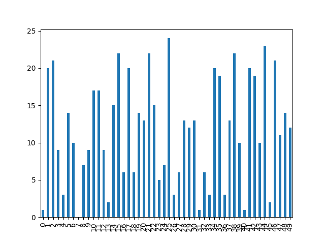
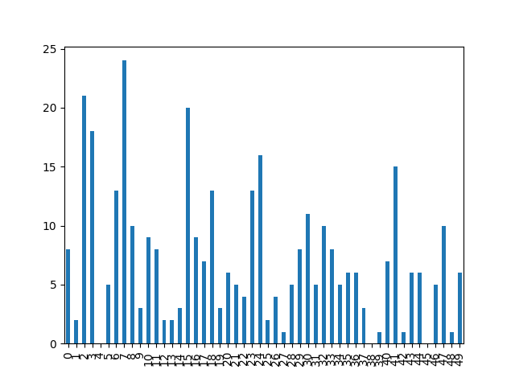
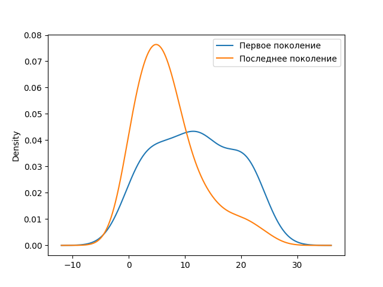
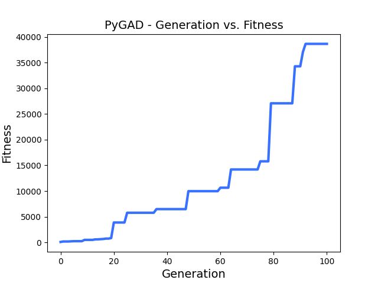

# Генетическое программирование при помощи PyGAD

## Задача: создать с помощью генетического программирования 50 чисел в диапозоне от 0 до 25 и проверить нормальное ли распределение при помощи критерия Колмогорова-Смирнова

Нам понадобится `pip install pygad pandas scipy` (последнии два для работы с массивами данных)

```python
import pygad

num_generations = 100 # Количество поколений
num_parents_mating = 10 # Количество решений, которые будут выбраны в качестве родителей
sol_per_pop = 20 # Количество решений в популяции
num_genes = 50 # Количество чисел
gene_space = range(25) # Диапазон чисел

# Класс GA для построения генетического алгоритма
ga_instance = pygad.GA(num_generations=num_generations,    
                       num_parents_mating=num_parents_mating,
                       sol_per_pop=sol_per_pop,
                       num_genes=num_genes,
                       gene_space=gene_space,
                       fitness_func=fitness_func,
                       on_generation=on_generation)
```
```python
last_fitness = 0

# Эта функция запускается в конце каждого поколения, в нашем случае, для того, чтобы узнать изменения между поколениями
def on_generation(ga_instance):
    global last_fitness
    print("Generation = {}".format(ga_instance.generations_completed))
    print("Fitness = {}".format(ga_instance.best_solution(pop_fitness=ga_instance.last_generation_fitness)[1]))
    print("Change = {}".format(ga_instance.best_solution(pop_fitness=ga_instance.last_generation_fitness)[1] - last_fitness))
    last_fitness = ga_instance.best_solution(pop_fitness=ga_instance.last_generation_fitness)[1]
```
```python
import numpy

# Функция, которая возращает значение пригодности решения
def fitness_func(solution, solution_idx):
    pv, sv = kolmogorov_smirnov(solution) # Критерий К-С (см. ниже)
    # Чем больше pv и ниже sv тем более вероятнее нормальность распределения
    # sv умножаю на 20, потому что по моему опыту sv часто принимает довольно маленькие значения, а 20 выявленно опытным путем
    fitness = 2 / (numpy.abs(1 - pv) + sv*20) 
    return fitness 
```
```python
import pandas
from scipy import stats

# Критерий Колмогорова-Смирнова
def kolmogorov_smirnov(solution):
    df = pandas.DataFrame(data={
        'solution': solution
    })
    # Первое и последнее поколение записываю для того, чтобы потом сравнить
    if (ga_instance.generations_completed == num_generations or ga_instance.generations_completed == 0):
        df.to_csv("solution_{}.csv".format(ga_instance.generations_completed))

    return stats.kstest(df, 'norm', (df.mean(), df.std()), N=5000) # Возвращает два значения: К-С-статитстика и Р-значение
```
```python 
# Для запуска генетического алгоритма
ga_instance.run()
```
<details><summary>Вот что получится:</summary><blockquote> 

Generation = 1
  
Fitness = 173.97205904998307
  
Change = 173.97205904998307

Generation = 2

Fitness = 173.97205904998307

Change = 0.0

Generation = 3

Fitness = 173.97205904998307

Change = 0.0

Generation = 4

Fitness = 207.90999501388512

Change = 33.93793596390205

Generation = 5

Fitness = 234.29747904754262

Change = 26.3874840336575

Generation = 6

Fitness = 234.29747904754262

Change = 0.0

Generation = 7

Fitness = 234.29747904754262

Change = 0.0

Generation = 8

Fitness = 234.29747904754262

Change = 0.0

Generation = 9

Fitness = 486.28438033295816

Change = 251.98690128541554

Generation = 10

Fitness = 486.28438033295816

Change = 0.0

Generation = 11

Fitness = 486.28438033295816

Change = 0.0

Generation = 12

Fitness = 486.28438033295816

Change = 0.0

Generation = 13

Fitness = 581.3454941334909

Change = 95.06111380053272

Generation = 14

Fitness = 588.1418764119002

Change = 6.796382278409283

Generation = 15

Fitness = 625.9091480027296

Change = 37.76727159082941

Generation = 16

Fitness = 659.4457633292234

Change = 33.5366153264938

Generation = 17

Fitness = 735.1817271873213

Change = 75.73596385809788

Generation = 18

Fitness = 735.1817271873213

Change = 0.0

Generation = 19

Fitness = 838.4842310379203

Change = 103.30250385059901

Generation = 20

Fitness = 3870.4022261665687

Change = 3031.9179951286483

Generation = 21

Fitness = 3870.4022261665687

Change = 0.0

Generation = 22

Fitness = 3870.4022261665687

Change = 0.0

Generation = 23

Fitness = 3870.4022261665687

Change = 0.0

Generation = 24

Fitness = 3870.4022261665687

Change = 0.0

Generation = 25

Fitness = 5769.722842928234

Change = 1899.3206167616654

Generation = 26

Fitness = 5769.722842928234

Change = 0.0

Generation = 27

Fitness = 5769.722842928234

Change = 0.0

Generation = 28

Fitness = 5769.722842928234

Change = 0.0

Generation = 29

Fitness = 5769.722842928234

Change = 0.0

Generation = 30

Fitness = 5769.722842928234

Change = 0.0

Generation = 31

Fitness = 5769.722842928234

Change = 0.0

Generation = 32

Fitness = 5769.722842928234

Change = 0.0

Generation = 33

Fitness = 5769.722842928234

Change = 0.0

Generation = 34

Fitness = 5769.722842928234

Change = 0.0

Generation = 35

Fitness = 5769.722842928234

Change = 0.0

Generation = 36

Fitness = 6478.477391884017

Change = 708.7545489557833

Generation = 37

Fitness = 6478.477391884017

Change = 0.0

Generation = 38

Fitness = 6478.477391884017

Change = 0.0

Generation = 39

Fitness = 6478.477391884017

Change = 0.0

Generation = 40

Fitness = 6478.477391884017

Change = 0.0

Generation = 41

Fitness = 6478.477391884017

Change = 0.0

Generation = 42

Fitness = 6478.477391884017

Change = 0.0

Generation = 43

Fitness = 6478.477391884017

Change = 0.0

Generation = 44

Fitness = 6478.477391884017

Change = 0.0

Generation = 45

Fitness = 6478.477391884017

Change = 0.0

Generation = 46

Fitness = 6478.477391884017

Change = 0.0

Generation = 47

Fitness = 6478.477391884017

Change = 0.0

Generation = 48

Fitness = 9972.01232198448

Change = 3493.5349301004635

Generation = 49

Fitness = 9972.01232198448

Change = 0.0

Generation = 50

Fitness = 9972.01232198448

Change = 0.0

Generation = 51

Fitness = 9972.01232198448

Change = 0.0

Generation = 52

Fitness = 9972.01232198448

Change = 0.0

Generation = 53

Fitness = 9972.01232198448

Change = 0.0

Generation = 54

Fitness = 9972.01232198448

Change = 0.0

Generation = 55

Fitness = 9972.01232198448

Change = 0.0

Generation = 56

Fitness = 9972.01232198448

Change = 0.0

Generation = 57

Fitness = 9972.01232198448

Change = 0.0

Generation = 58

Fitness = 9972.01232198448

Change = 0.0

Generation = 59

Fitness = 9972.01232198448


Change = 0.0

Generation = 60

Fitness = 10645.766581059212

Change = 673.7542590747307

Generation = 61

Fitness = 10645.766581059212

Change = 0.0

Generation = 62

Fitness = 10645.766581059212

Change = 0.0

Generation = 63


Fitness = 10645.766581059212

Change = 0.0

Generation = 64

Fitness = 14200.750243239136

Change = 3554.983662179924

Generation = 65

Fitness = 14200.750243239136

Change = 0.0

Generation = 66

Fitness = 14200.750243239136

Change = 0.0

Generation = 67

Fitness = 14200.750243239136

Change = 0.0


Generation = 68

Fitness = 14200.750243239136

Change = 0.0

Generation = 69

Fitness = 14200.750243239136

Change = 0.0

Generation = 70

Fitness = 14200.750243239136

Change = 0.0

Generation = 71

Fitness = 14200.750243239136

Change = 0.0

Generation = 72

Fitness = 14200.750243239136

Change = 0.0

Generation = 73

Fitness = 14200.750243239136

Change = 0.0

Generation = 74

Fitness = 14200.750243239136

Change = 0.0


Generation = 75

Fitness = 15786.507861151427

Change = 1585.7576179122916

Generation = 76

Fitness = 15786.507861151427

Change = 0.0

Generation = 77

Fitness = 15786.507861151427

Change = 0.0

Generation = 78

Fitness = 15786.507861151427

Change = 0.0

Generation = 79

Fitness = 27082.244692195585

Change = 11295.736831044158

Generation = 80

Fitness = 27082.244692195585

Change = 0.0

Generation = 81

Fitness = 27082.244692195585

Change = 0.0

Generation = 82

Fitness = 27082.244692195585

Change = 0.0

Generation = 83

Fitness = 27082.244692195585

Change = 0.0

Generation = 84

Fitness = 27082.244692195585

Change = 0.0

Generation = 85

Fitness = 27082.244692195585

Change = 0.0

Generation = 86

Fitness = 27082.244692195585

Change = 0.0

Generation = 87

Fitness = 27082.244692195585

Change = 0.0

Generation = 88

Fitness = 34286.45638458348

Change = 7204.211692387893

Generation = 89

Fitness = 34286.45638458348

Change = 0.0

Generation = 90

Fitness = 34286.45638458348

Change = 0.0

Generation = 91

Fitness = 37081.92334684217

Change = 2795.4669622586953

Generation = 92

Fitness = 38659.799502593814

Change = 1577.876155751641

Generation = 93

Fitness = 38659.799502593814

Change = 0.0

Generation = 94

Fitness = 38659.799502593814

Change = 0.0

Generation = 95

Fitness = 38659.799502593814

Change = 0.0

Generation = 96

Fitness = 38659.799502593814

Change = 0.0

Generation = 97

Fitness = 38659.799502593814

Change = 0.0

Generation = 98

Fitness = 38659.799502593814

Change = 0.0

Generation = 99

Fitness = 38659.799502593814

Change = 0.0

Generation = 100

Fitness = 38659.799502593814

Change = 0.0
</blockquote></details>

## Графики

```python
df1 = pandas.read_csv("solution_0.csv")
df2 = pandas.read_csv("solution_{}.csv".format(num_generations))

df1['solution'].plot(kind='bar')
```


```python
df2['solution'].plot(kind='bar')
```


## Распределение:
```python
df12 = pandas.DataFrame(data={
    'Первое поколение': df1['solution'],
    'Последнее поколение': df2['solution'],
})
df12.plot.kde()
```


## Зависимость значение fitness от поколения
```python
filename = 'genetic'
ga_instance.save(filename=filename)
loaded_ga_instance = pygad.load(filename=filename)
loaded_ga_instance.plot_fitness()
```

